# Janji
Saya Muhammad 'Azmi Salam dengan NIM 2406010 mengerjakan Tugas Praktikum 1 pada Mata Kuliah Desain dan Pemrograman Berorientasi Objek (DPBO) untuk keberkahan-Nya maka saya tidak melakukan kecurangan seperti yang telah dispesifikasikan. Aamiin

# Desain
Program terdiri dari __1__ class, yaitu __Electronic__ yang terdiri dari atribut berikut:
- ID
- Name
- Category
- Price
- Photo (khusus PHP)

# Dokumentasi & Penjelasan
Untuk alur dalam __C++__, __Java__, dan __Python__, Setelah program dijalankan, user dapat memilih satu dari enam opsi command:
- `INSERT` untuk menambahkan data baru (INSERT "[Name]" "[Category]" [Price]),
- `DELETE` untuk menghapus data (DELETE [ID]),
- `UPDATE` untuk mengubah data (UPDATE [ID] "[Name]" "[Category]" [Price]),
- `SEARCH` untuk mencari data berdasarkan nama (SEARCH "[Name]"),
- `SHOW` untuk menunjukkan semua data yang ada, dan
- `EXIT` untuk keluar atau mengakhiri program.

Catatan:
- Format penulisan command dapat dilihat dengan menjalankan command `ELECTRONIC`,
- ID pada program __auto increment__ atau akan otomatis di-set,
- Opsi command bersifat __case-insensitive__, yaitu tetap dapat dioperasikan walaupun command adalah `insert`, `InSeRt`, `deLEte`, dan lain lain,
- Jika command yang dimasukkan di luar dari pilihan, program akan menampilkan pesan "__Command not found!__",
- Jika menjalankan command `SHOW` atau `SEARCH` dengan data kosong, program akan menampilkan pesan "__Data is empty!__",
- Jika menjalankan command `SEARCH` dengan nama yang tidak ada pada list data, program akan menampilkan pesan "__Data with name \'[Nama]\' not found!__", dan
- Program akan menerima input hingga command `EXIT`.

## C++

    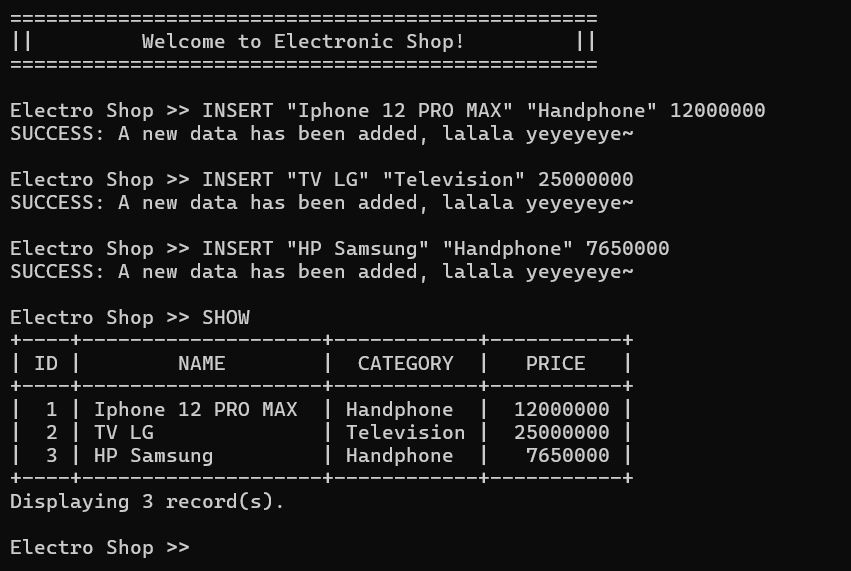
    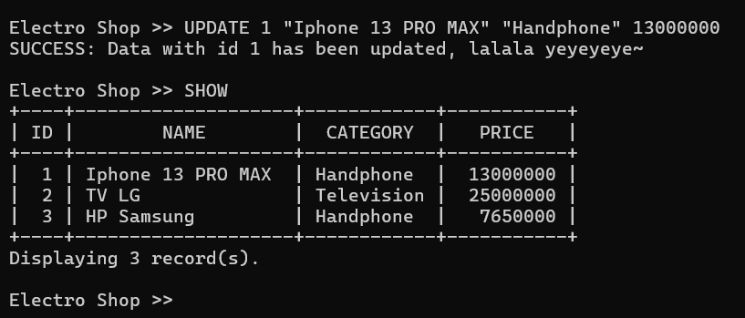
    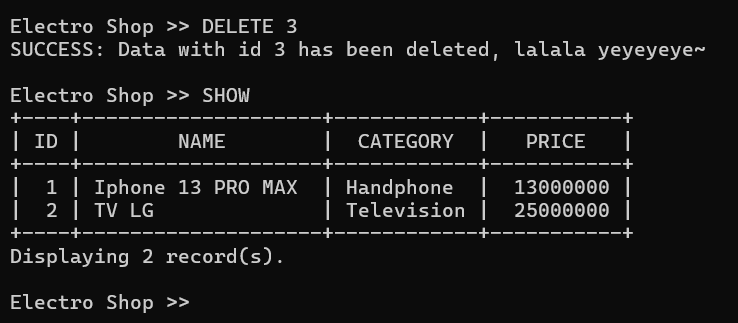
    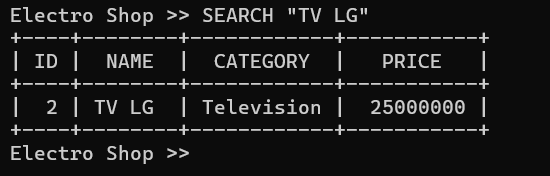
    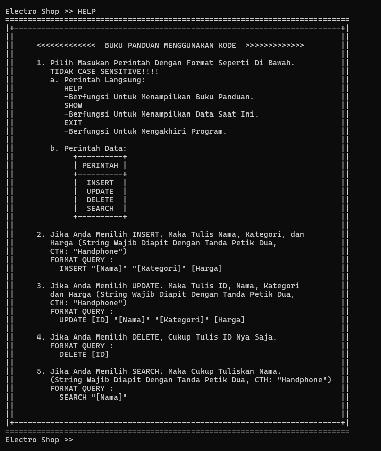
    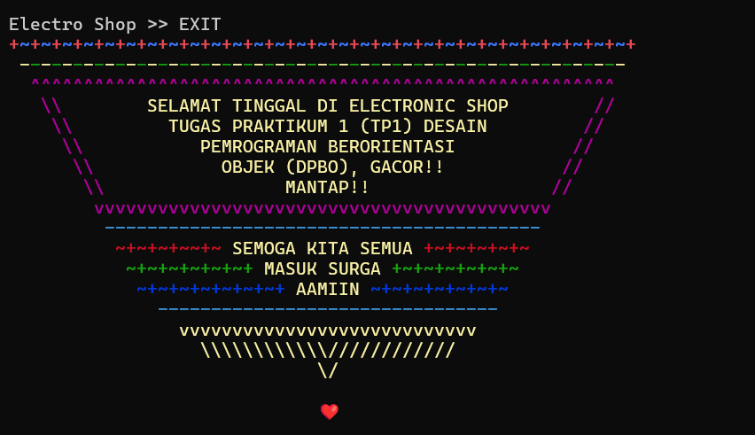

## JAVA

    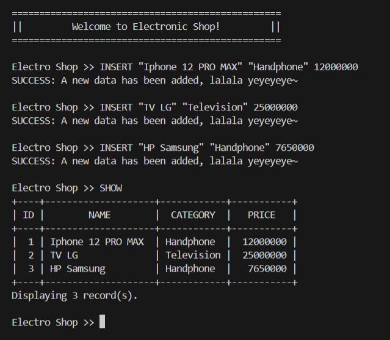
    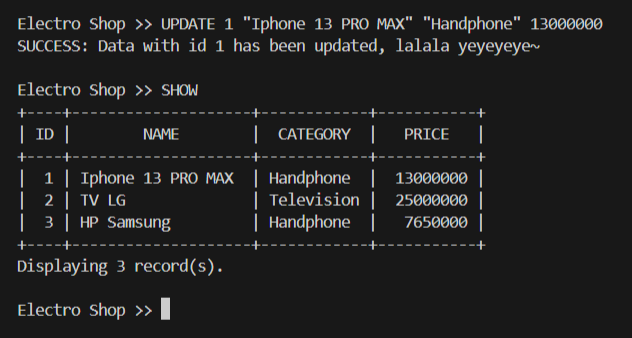
    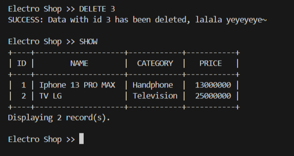
    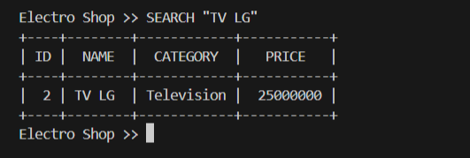
    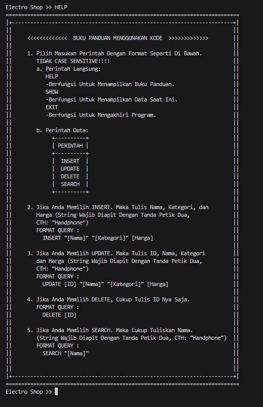
    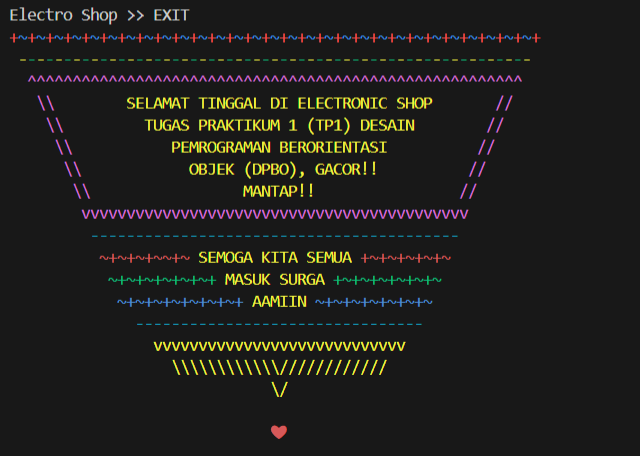

## PYTHON

    
    
    
    
    
    

## PHP
Untuk alur dalam __PHP__, program akan ditampilkan pada laman web seperti localhost dengan tampilan:
- Header dengan judul dan toggle button,
- List gambar yang dapat digunakan dengan klik toggle button,
- Tampilan tabel dengan kolom berisi atribut dari class,
- Tampilan CLI untuk wadah command yang dapat dimasukkan user,

User dapat memilih satu dari empat opsi command:
- `INSERT` untuk menambahkan data baru (INSERT "\[Name]" "[Category]" [Price] "[Photo]"),
- `UPDATE` untuk mengubah data (UPDATE [ID] "[Name]" "[Category]" [Price] "[Photo]"), dan
- `DELETE` untuk menghapus data (DELETE [ID]),
- `SEARCH` untuk mencari data berdasarkan nama (SEARCH "[Name]").

Catatan:
- Format penulisan command dapat dilihat dengan menjalankan command `ELECTRONIC`,
- ID pada program __auto increment__ atau akan otomatis di-set,
- Opsi command bersifat __case-insensitive__, yaitu tetap dapat dioperasikan walaupun command adalah `insert`, `UpdaTe`, `deLeTe`, dan lain lain,
- Jika command yang dimasukkan di luar dari pilihan, program akan menampilkan pesan "__Command not found!__",
- Jika menjalankan command `SEARCH` dengan nama yang tidak ada pada list data, program akan menampilkan pesan "__Data with name \'\<Name\>\' not found!__",
- Program akan menunjukkan hasil pencarian dengan __meng-highlight__ baris yang dicari,
- Command `SHOW` akan otomatis dijalankan (tabel akan di-refresh) setelah setiap command lain dijalankan,
- Foto hanya bisa menggunakan asset yang ada pada __list gambar__,
- Gambar hanya dapat diubah, ditambahkan, dan dihapus __di luar dari program__

