# Janji
Saya Muhammad 'Azmi Salam dengan NIM 2406010 mengerjakan Tugas Praktikum 1 pada Mata Kuliah Desain dan Pemrograman Berorientasi Objek (DPBO) untuk keberkahan-Nya maka saya tidak melakukan kecurangan seperti yang telah dispesifikasikan. Aamiin

# Struktur File
```
Main
├── CPP/
│   ├── Elektronic.cpp
│   └── main.cpp
│
├── Java/
│   ├── Elektronic.java
│   └── Main.java
│
├── Python/
│   ├── elektronic.py
│   └── main.py
│
├── PHP/
│   ├── Elektronic.php
│   └── index.php
│
├── Dokumentasi/
│   ├── cpp
│   |   ├── cpp1.php
│   |   ├── cpp2.php
│   |   ├── cpp3.php
│   |   ├── cpp4.php
│   |   ├── cpp5.php
│   |   └── cpp6.php
│   |
│   ├── java
│   |   ├── java1.php
│   |   ├── java2.php
│   |   ├── java3.php
│   |   ├── java4.php
│   |   ├── java5.php
│   |   └── java6.php
│   |
│   ├── py
│   |   ├── py1.php
│   |   ├── py2.php
│   |   ├── py3.php
│   |   ├── py4.php
│   |   ├── py5.php
│   |   └── py6.php
│   |
│   └── php
│       ├── php1.php
│       ├── php2.php
│       ├── php3.php
│       ├── php4.php
│       ├── php5.php
│       └── php6.php
│
└── README.md
```

# Desain
Program terdiri dari __1__ class, yaitu __Electronic__ yang terdiri dari atribut berikut:
- ID
- Name
- Category
- Price
- Photo (khusus PHP)

# Panduan
```
============================================================================
|+------------------------------------------------------------------------+|
||                                                                        ||
||     <<<<<<<<<<<<<  BUKU PANDUAN MENGGUNAKAN KODE  >>>>>>>>>>>>>        ||
||                                                                        ||
||     1. Pilih Masukan Perintah Dengan Format Seperti Di Bawah.          ||
||        TIDAK CASE SENSITIVE!!!!                                        ||
||        a. Perintah Langsung:                                           ||
||           HELP                                                         ||
||           -Berfungsi Untuk Menampilkan Buku Panduan.                   ||
||           SHOW                                                         ||
||           -Berfungsi Untuk Menampilkan Data Saat Ini.                  ||
||           EXIT                                                         ||
||           -Berfungsi Untuk Mengakhiri Program.                         ||
||                                                                        ||
||        b. Perintah Data:                                               ||
||             +----------+                                               ||
||             | PERINTAH |                                               ||
||             +----------+                                               ||
||             |  INSERT  |                                               ||
||             |  UPDATE  |                                               ||
||             |  DELETE  |                                               ||
||             |  SEARCH  |                                               ||
||             +----------+                                               ||
||                                                                        ||
||     2. Jika Anda Memilih INSERT. Maka Tulis Nama, Kategori, dan        ||
||        Harga (String Wajib Diapit Dengan Tanda Petik Dua,              ||
||        CTH: "Handphone")                                               ||
||        FORMAT QUERY :                                                  ||
||          INSERT "[Nama]" "[Kategori]" [Harga]                          ||
||                                                                        ||
||     3. Jika Anda Memilih UPDATE. Maka Tulis ID, Nama, Kategori         ||
||        dan Harga (String Wajib Diapit Dengan Tanda Petik Dua,          ||
||        CTH: "Handphone")                                               ||
||        FORMAT QUERY :                                                  ||
||          UPDATE [ID] "[Nama]" "[Kategori]" [Harga]                     ||
||                                                                        ||
||     4. Jika Anda Memilih DELETE, Cukup Tulis ID Nya Saja.              ||
||        FORMAT QUERY :                                                  ||
||          DELETE [ID]                                                   ||
||                                                                        ||
||     5. Jika Anda Memilih SEARCH. Maka Cukup Tuliskan Nama.             ||
||        (String Wajib Diapit Dengan Tanda Petik Dua, CTH: "Handphone")  ||
||        FORMAT QUERY :                                                  ||
||          SEARCH "[Nama]"                                               ||
||                                                                        ||
||                                                                        ||
|+------------------------------------------------------------------------+|
============================================================================
```

## C++
<div>
    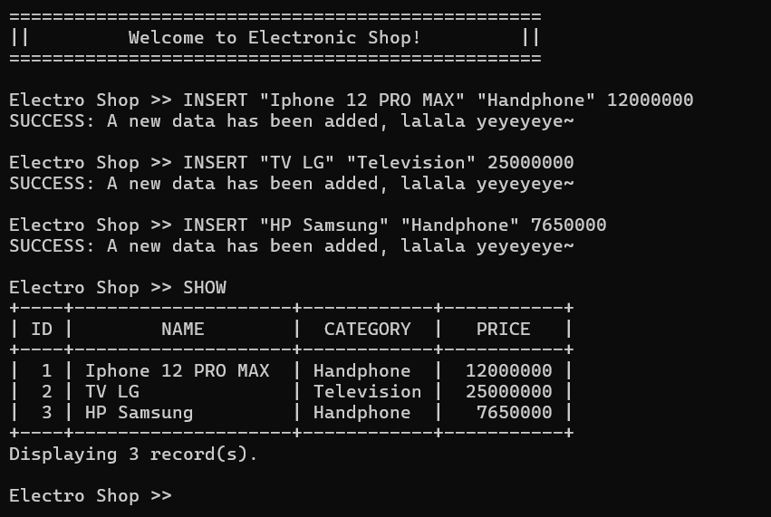
    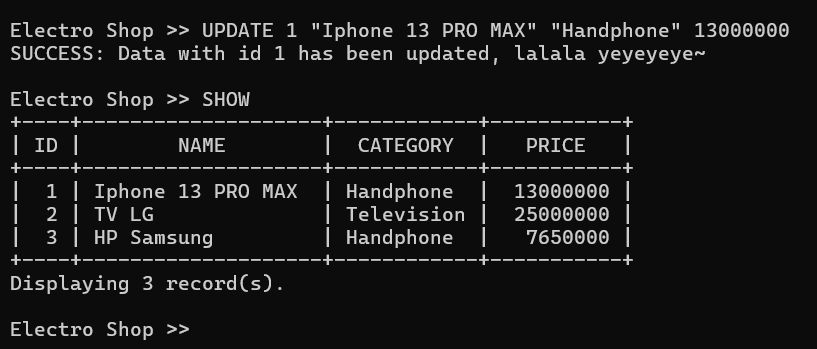
    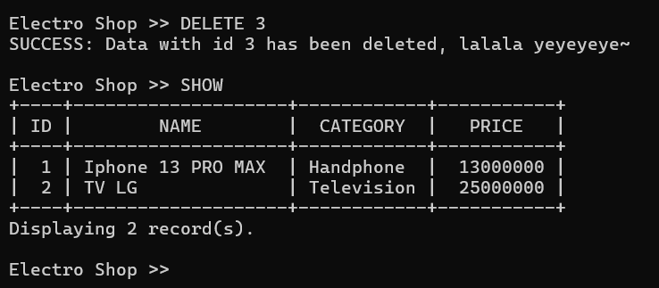
    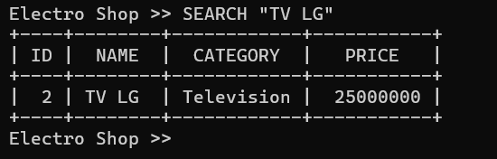
    <!-- 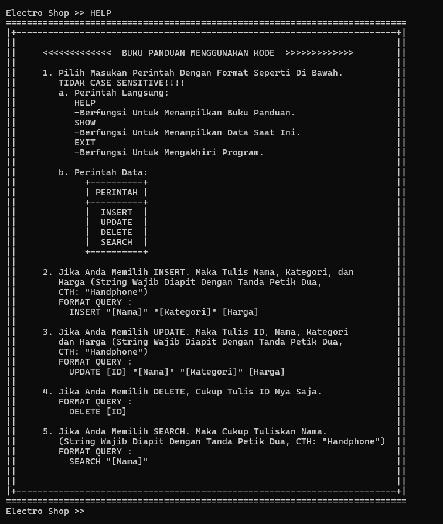 -->
    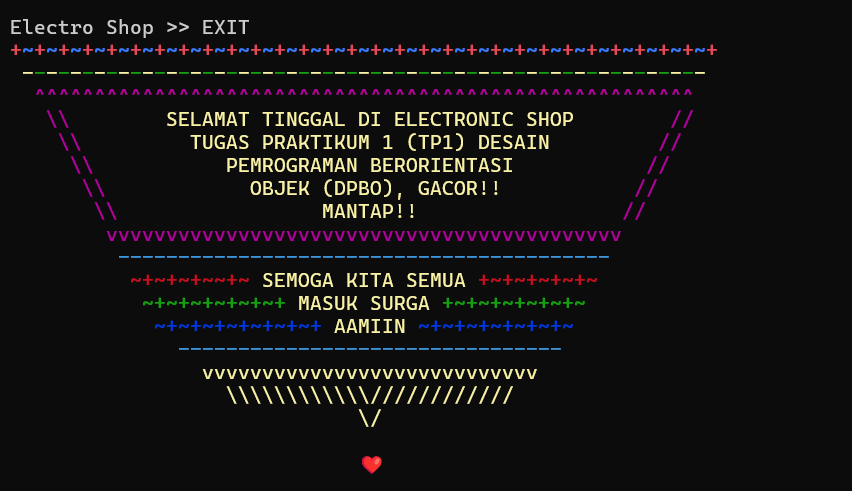
</div>

## JAVA
<div>
    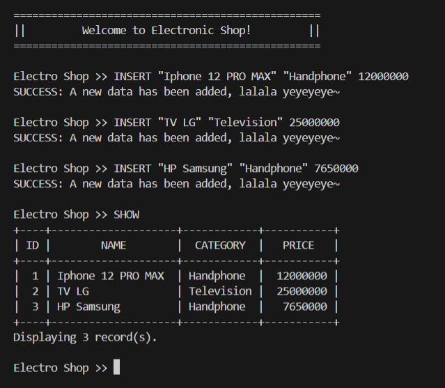
    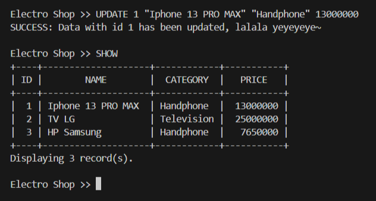
    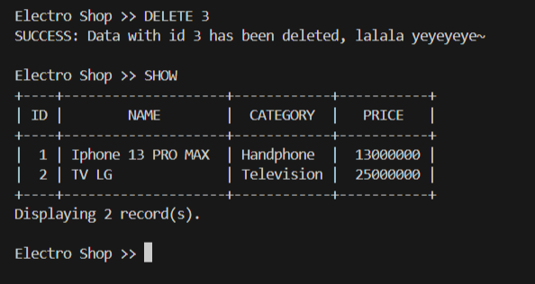
    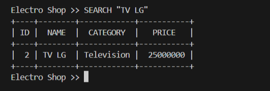
    <!-- 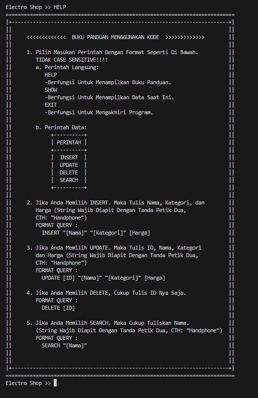 -->
    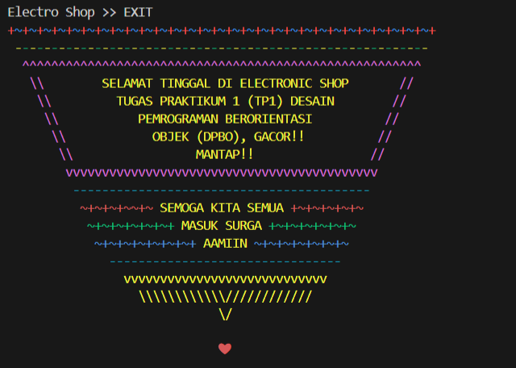
</div>

## PYTHON
<div>
    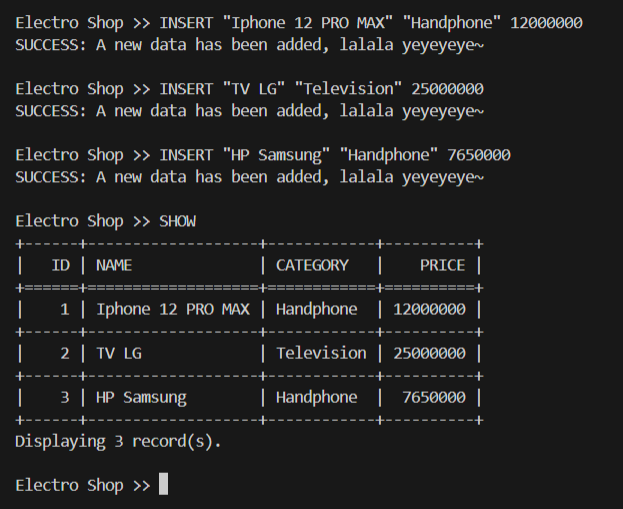
    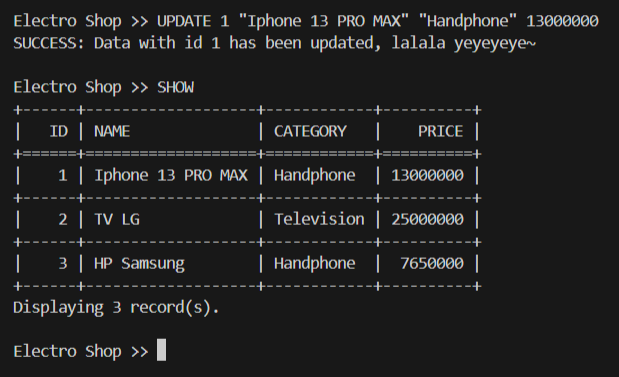
    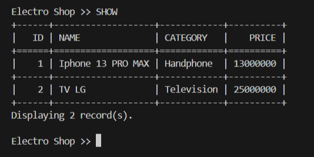
    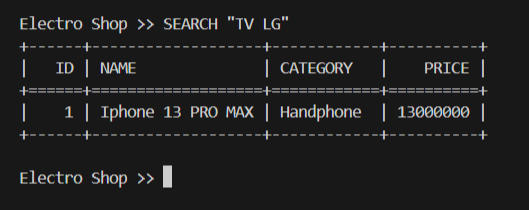
    <!-- 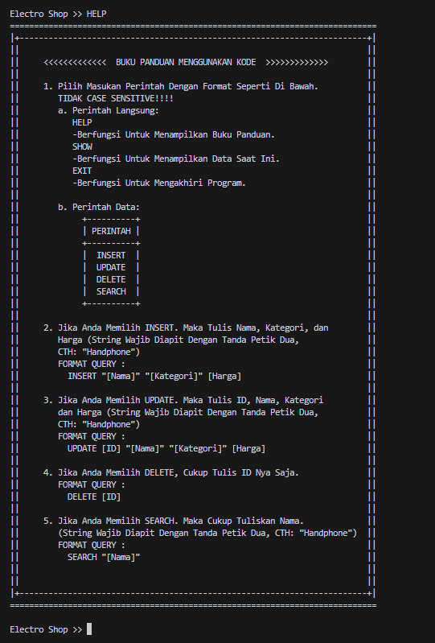 -->
    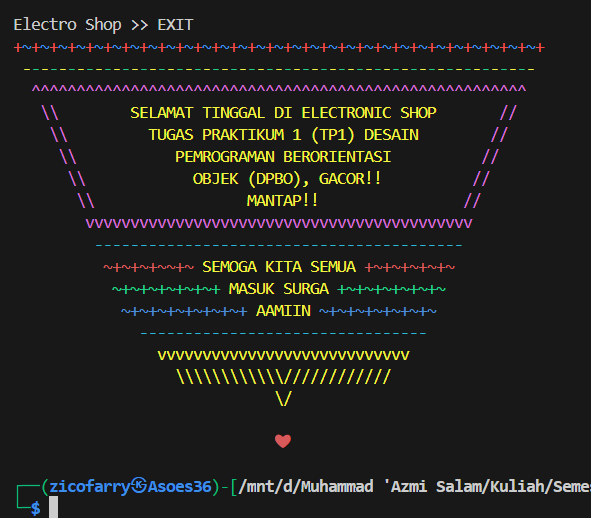
</div>

## PHP
<div>
    
    
    
    
    <!--  -->
    
</div>
